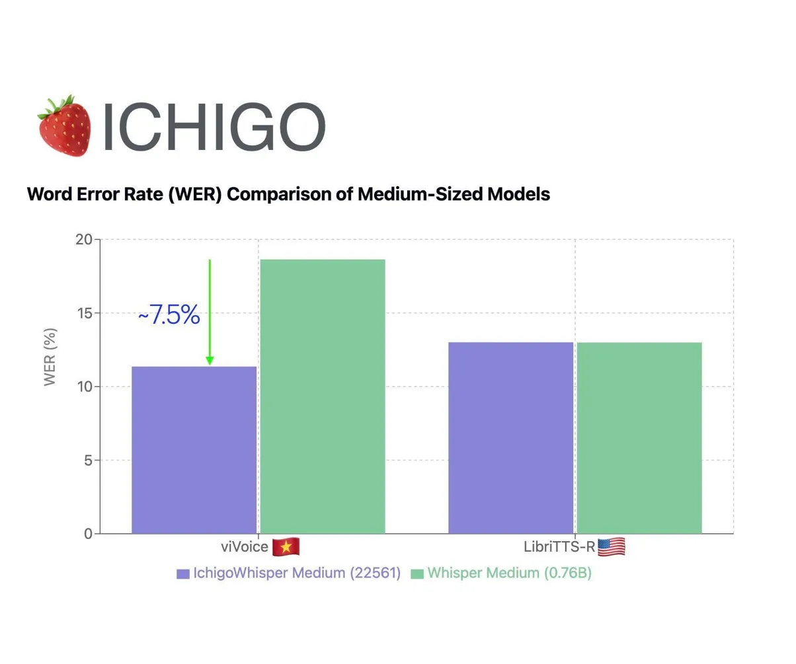

<div align="center">

# 🍰 Ichigo-Whisper.
<a href=''></a>
<a href='https://ichigo-whisper.homebrew.ltd/'></a>
<a href='https://arxiv.org/pdf/2410.15316'></a>
<a href='https://huggingface.co/homebrewltd/Ichigo-whisper-v0.1'></a>
<a href=''></a>

[**About**](#about) | [**Demo**](#demo) | [**Model Summary**](#model-summary) | [**Training**](#training)


  
  <p><small>Homebrewed ASR quantizer model</a></small></p>
</div>

## About

Ichigo Whisper is a compact (22M parameters), open-source quantizer for the `Whisper-medium model`, designed to enhance performance on *low-resource languages* with minimal impact on its original English capabilities. Unlike models that output continuous embeddings, Ichigo Whisper compresses speech into discrete tokens, making it more compatible with large language models (LLMs) for immediate speech understanding.

This quantized version of Whisper-medium has been trained on over ~400 hours of English data and ~1000 hours of Vietnamese data.

Ichigo Whisper is a key component of the Ichigo v0.5 family.

<div align="center">

  
  <p><small>Homebrewed early-fusion speech model and ASR model</a></small></p>
</div>

## Model Summary

## How to Get Started

### Installation
1. Create virtual enviroment
   ```bash
   python -m venv ichigo-whisper
   source ichigo-whisper/bin/activate
   ```
2. Clone the repository and install requirement packages (Python 3.11)
   ```bash
   git clone https://github.com/janhq/WhisperSpeech.git
   cd WhisperSpeech/ichigo-whisper
   pip install -r requirements.txt
   ```
3. Login Huggingface CLI and WandB
   ```bash
   huggingface-cli login
   wandb login
   ```
### Training
Modify config and run scripts
```bash
sh scripts/train_multi.sh
```

### Testing
After training, modify inference config and run scripts
```bash
sh scripts/test.sh
```

### Inference
```bash
python demo/inference.py --input path/to/your/audio.wav
```

### Demo
```python
python demo/app.py
```

## Join Us

🍰 Ichigo Whisper is an open research project. We're looking for collaborators, and will likely move towards crowdsourcing speech datasets in the future. 

## Acknowledgement

- [WhisperSpeech](https://github.com/collabora/WhisperSpeech): Text-to-speech model for synthetic audio generation
- [Gradio](https://www.gradio.app/): 

